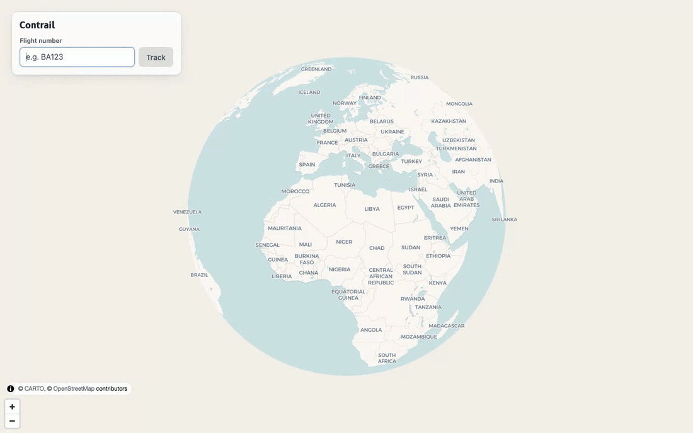

# interactive-flight



Enter a flight number, see it tracked live on a map: the flown portion of its
route, current position (or a best-effort estimate when live position isn't
reported), and a hover tooltip with the flight number. A details panel opens
alongside the map as soon as a flight is found (a bottom sheet on phones). It
leads with a plain-language status ("Landed 16 min early", "In the air · 42 min
late") colored by whether the flight is on time, then scheduled vs. actual
times in each airport's own time zone, route progress, live altitude, speed,
heading and climb/descent rate, the aircraft (age, seats, engines, first
flight, and a photo when one is available), and departure/arrival weather.
While a flight is active, it refreshes every minute.

## Setup

1. Get a free [AeroDataBox](https://rapidapi.com/aedbx-aedbx/api/aerodatabox) API key via RapidAPI.
2. Copy `server/.env.example` to `server/.env` and fill in `AERODATABOX_RAPIDAPI_KEY`.
3. Install dependencies:
   ```bash
   npm install --prefix server
   npm install --prefix web
   ```
4. Run everything:
   ```bash
   npm run dev
   ```
   This starts the API proxy on `http://localhost:8787` and the web app on
   `http://localhost:5173`.

## How it works

- `web/` (Vite + React + TypeScript): `maplibre-gl` with its globe projection
  on CARTO's free Voyager vector tiles (admin boundaries and labels come from
  the basemap itself, not a separate data layer). The globe flattens into a
  regular map as you zoom in.
- `server/` (Express): proxies AeroDataBox so the API key never reaches the
  browser. Weather is fetched client-side from Open-Meteo (no key required).
- When a flight has no live ADS-B position reported, the plane's position is
  estimated by interpolating along the great-circle route based on elapsed
  time between scheduled/revised departure and arrival.
- Aircraft photos come from AeroDataBox, which sometimes returns a photo of a
  different aircraft. The server only keeps a photo whose caption mentions the
  aircraft's registration or type code (e.g. `A321`), so some flights show no
  photo. Kept photos are credited to their photographer (CC BY).
- Aircraft details (age, seats, engines, dates) come from a second AeroDataBox
  lookup by registration, cached in memory on the server for 24 hours per
  aircraft. If it fails, the search still succeeds without those details.
- While a flight is active (from an hour before departure until it's arrived or
  canceled), the frontend re-fetches it every 60 seconds, skipping refreshes
  while the tab is hidden. That's at most about 60 AeroDataBox requests per hour
  per open tab. Between refreshes, a 30-second local clock keeps the estimated
  position, progress bar and "X ago" labels current without any API calls.
